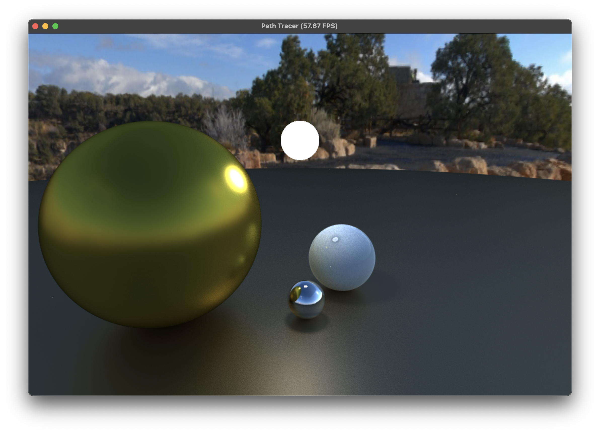

# Taichi Path tracer

a path tracer written in taichi

features:
* Global illumination via unbiased Monte Carlo path tracing
* Physically based Specular shading(GGX)
* Lambert diffuse shading
* Ray-Sphere intersection
* Unbiasd russain roule 
* Antialiasing via super-sampling
* Multiple importance sampling 
  * cosine-weighted pdf
  * ggx normal weighted pdf 

