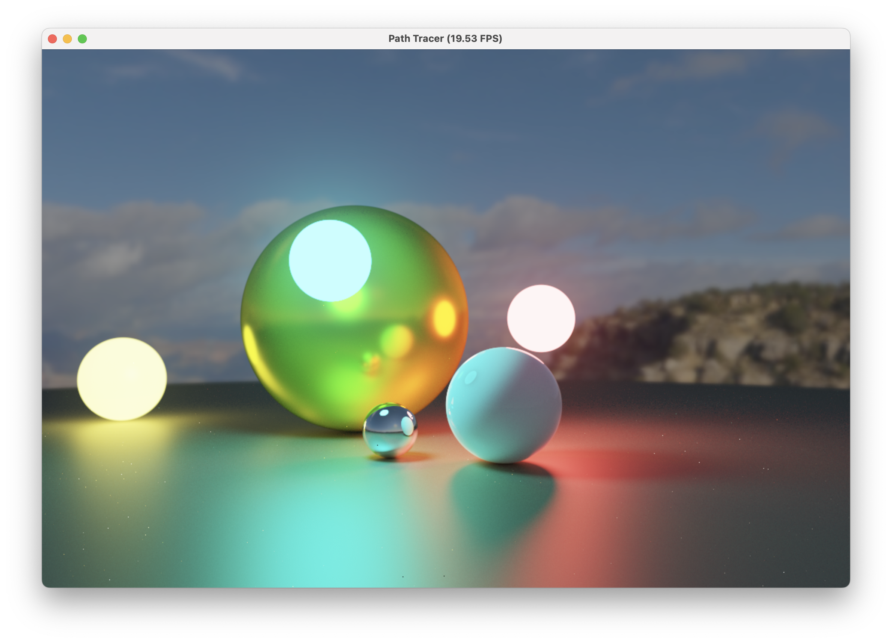

# Taichi Path tracer



A reatime path tracer written in taichi

#### Features:
* Global illumination via unbiased Monte Carlo path tracing
* Physically based Specular shading(GGX)
* Lambert diffuse shading
* Ray-Sphere intersection
* Unbiasd russain roule 
* Antialiasing via super-sampling
* Multiple importance sampling 
  * cosine-weighted pdf
  * ggx normal weighted pdf 

#### Usage

```bash
pip3 install taichi
python3 pt.py
```

and you a ready to go, **press and drag the mouse to see different rendering result**
